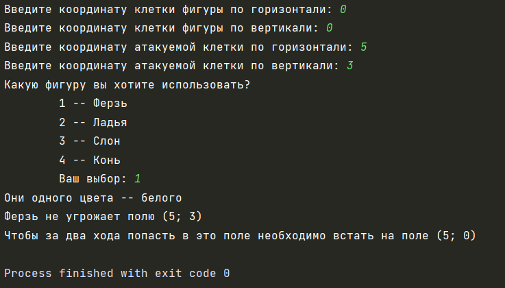
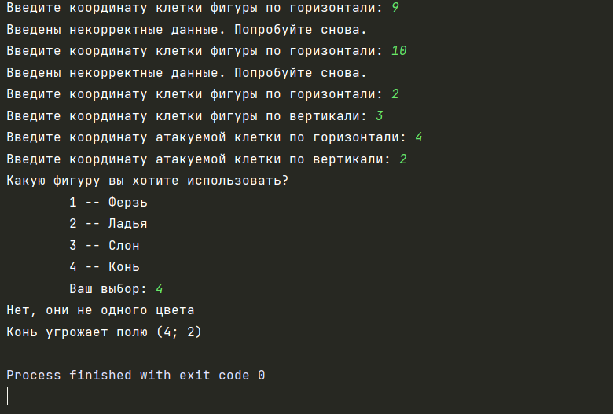
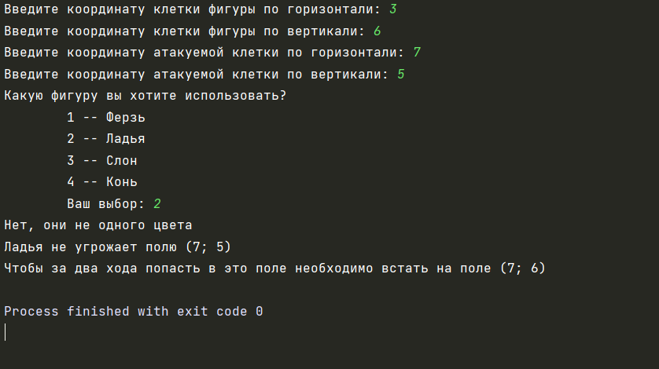

## Автор: 
Шляпникова Елена

## Задание:
 Написать на любом языке программу, просчитывающую ходы шахматных фигур на доске

## Описание:
Пользователь вводит координаты полей на шахматной доске. Далее пользователь выбирает фигуру, для которой будет просчитан ход.

## Тесты:

## Инструкция:

Для использования программы необходимо выполнить следующие действия:
1) Запустить программу
2) Ввести координаты ячейки, на которой стоит фигура
3) Ввести координаты ячейки, для которой нужно проверить, угрожает ли ей фигура
4) Выбрать фигуру
3) Получить результат выполнения

## Комментарий:

Для разработки данной программы использовалась среда разработки PyCharm.
Для открытия файла исходного кода можно использовать любую среду разработки.
